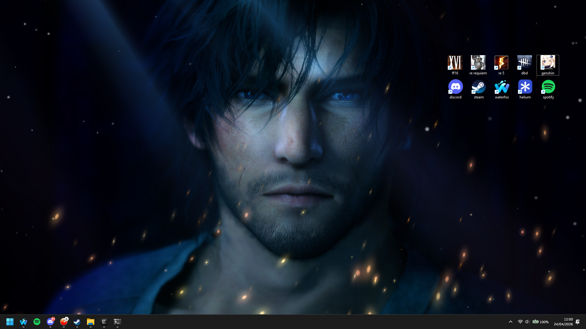

## Laptop

I have a Asus TUF Gaming A15 Laptop, with an AMD Ryzen 7 7435HS CPU, GeForce RTX
4060 Laptop GPU, 16GB Ram, and a 1TB SSD which is almost 100% full :3. My
desktop looks like this!

<small>Wallpaper: Clive Rosfield from FFXVI - my beloved</small>

> I would run linux but I'm too scared and Genshin Impact doesn't have official
> linux support T-T

## Software

- Browser: [Waterfox](https://www.waterfox.com/) mostly, [Helium](https://helium.computer/) if anything breaks
- Code Editor: [Zed](https://zed.dev/)
- Music: Spotify
- Gaming: Steam, GOG
- Discord: [Vencord](https://vencord.dev/) & OpenASAR
- Browser Extensions: Bitwarden, UBlock Origin, MAL-Sync, Violent Monkey

## Services

- [Spotify](https://spotify.com)
- [Posteo](https://posteo.de) - Green & Privacy-focused Email
- [Last.fm](https://last.fm) - Tracks music listening
- [Bitwarden](https://bitwarden.com) through [Vaultwarden](https://github.com/dani-garcia/vaultwarden) - my self-hosted password manager
